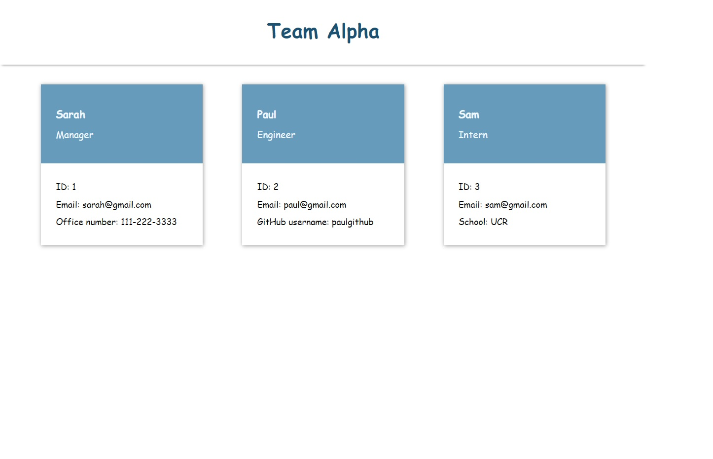

# Team-profile-generator (Object-Oriented Programming)

## Description

This is a Node.js command-line application that takes in information about employees from user's input through inquirer npm package and generates an HTML webpage that displays summaries for each employee.

## Table of Contents

- [Installation](#installation)
- [Usage](#usage)
- [Contributing](#contributing)
- [Tests](#tests)
- [Questions](#questions)

## Installtation

`npm install`

## Usage

[Original video link](https://watch.screencastify.com/v/z55YBXWiue99Y19VXSMd)

Main HTML page in the browser

## Tests

`node index`

## Questions

Find me on GitHub
infinissible
repo: https://github.com/infinissible

Email me with any questions
infinissible@gmail.com
